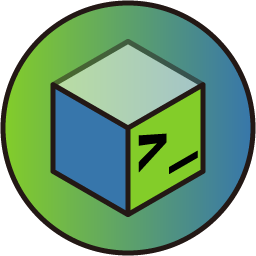
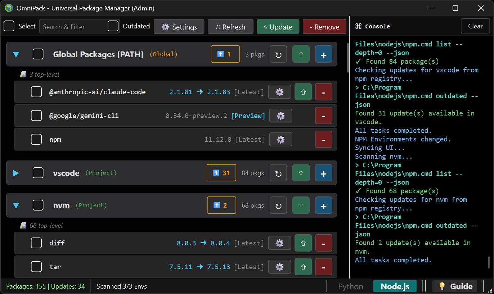
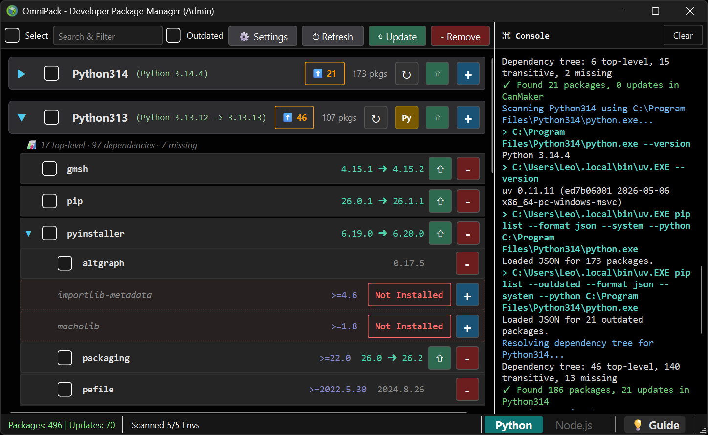
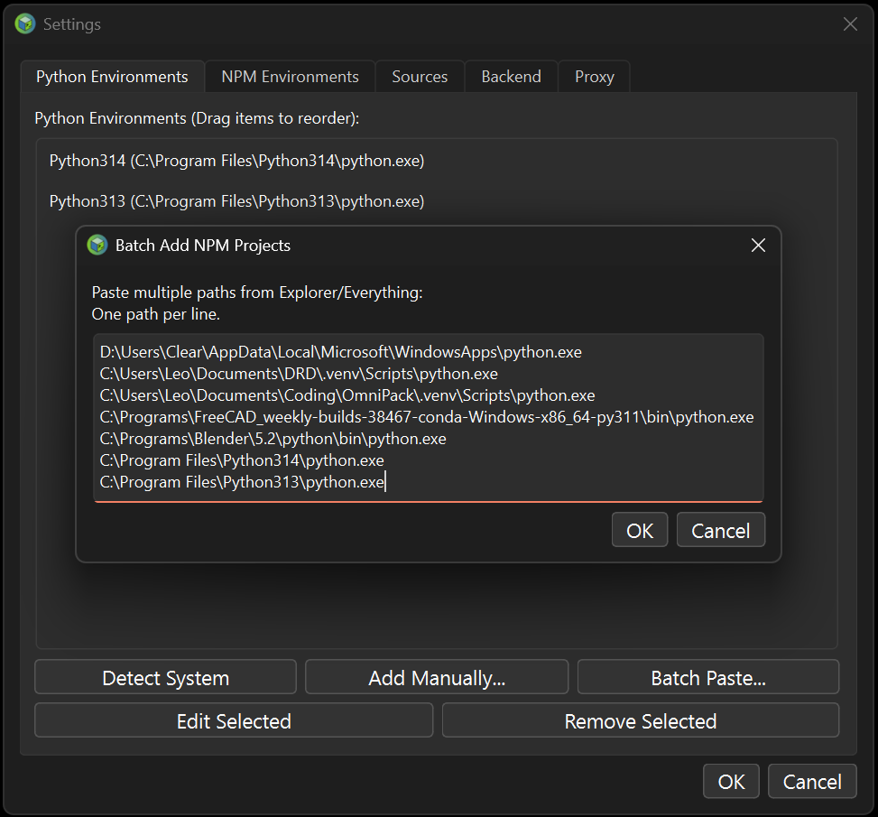
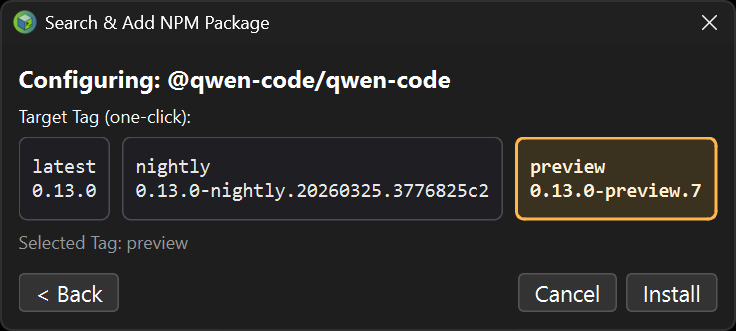
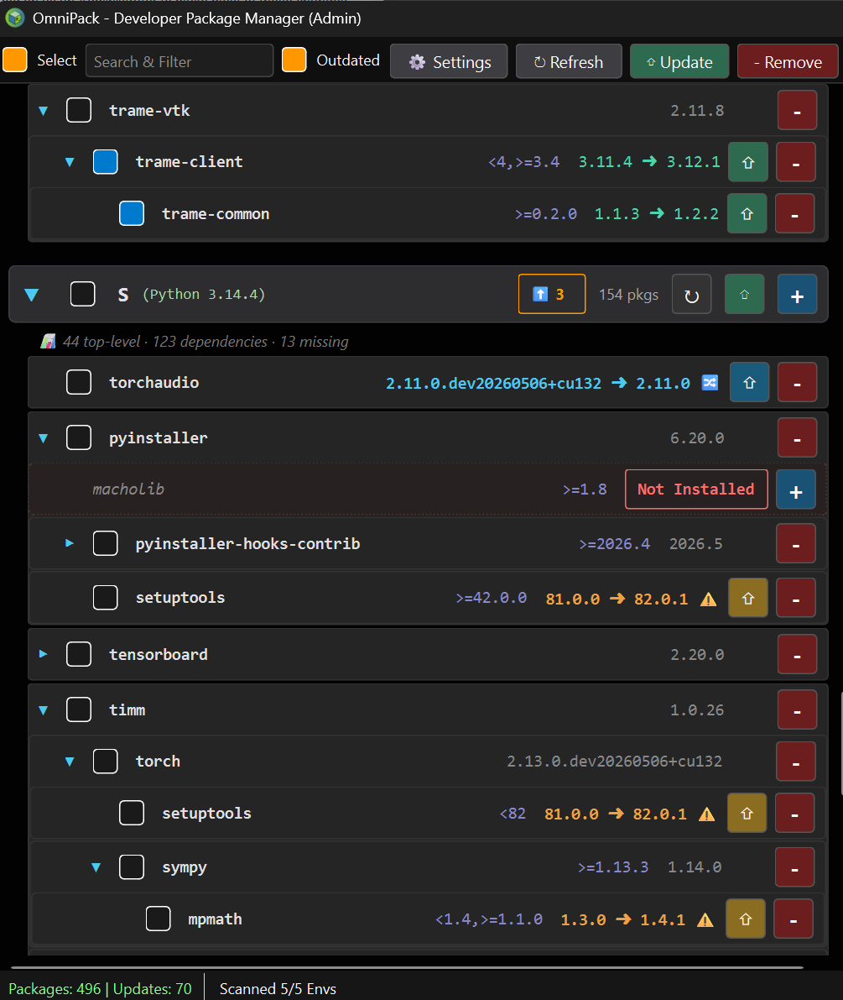
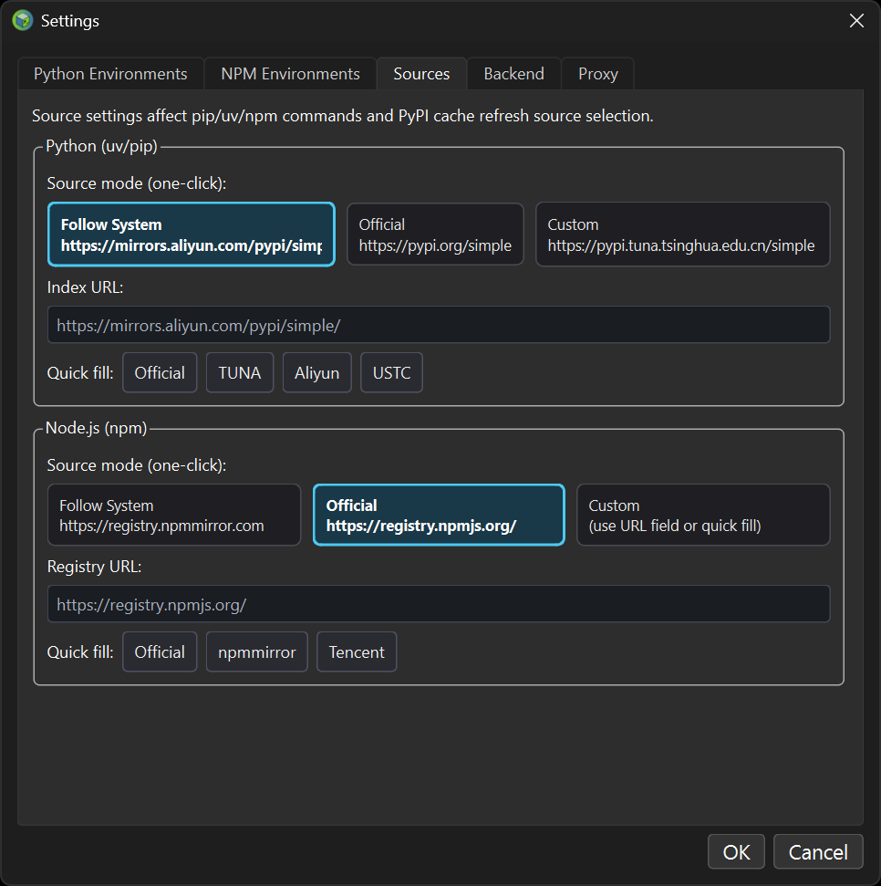

 

# OmniPack - Developer Package Manager

[English](./README.md) | [简体中文](./README.zh-CN.md)


*The ultimate **sandbox environment manager** for modern developers.*
> **OmniPack is a high-performance GUI wrapper for Python (uv/pip) and Node.js (npm).** It helps you manage scattered virtualenvs, explore deep dependency trees, and handle local packages with unprecedented visual efficiency.

---


## 💡 Why OmniPack?

There are already excellent global app stores like UniGetUI and powerful native CLI tools like `pip` and `npm`. **What pain power does OmniPack solve?**

If you're a seasoned developer, your disk is likely scattered with **dozens** of legacy project folders containing `.venv` or `node_modules`.
- Every time you want to check or update dependencies for a project, you have to find the path -> open terminal -> `cd` -> `activate` -> type long commands... 
- When facing a hundred-line flat `pip list` error, you have no easy way to know which **top-level dependency** introduced that conflicting version.

OmniPack was born for this: **It's not a system app store; it's your environment isolation micro-manager in a sea of engineering code.**

---

## ✨ Core Features

### 🚀 High-Speed Engine: Native `uv` Power
It's not just fast; it’s fast even in a GUI! OmniPack natively integrates [Astral sh](https://github.com/astral-sh/uv)'s acclaimed `uv` engine. Enjoy order-of-magnitude faster downloads and resolution compared to traditional pip.

### 🌳 Crystal Clear: Hierarchical Dependency Tree
Break free from the command-line’s flat list black box.
- **Top-Level View**: Filters out noise and reveals the dependency tree you actually manually installed.
- **Infinite Hierarchy**: Who pulled in what? It’s clear at a glance.
- **Ghost Deps Capture**: Automatically identifies libraries called in your code but never officially declared.



### 🗂️ Zero-Friction Management: Batch Environment Import
We know you have dozens of projects. Just select those folders in [Everything] or File Explorer, **Ctrl+C to copy paths**, and **Batch Paste** them into OmniPack with one click. Its detection engine automatically strips away `.venv` noise to extract clean project names.



### 🎯 Ultimate Node.js Version Control
More than just `npm install`. OmniPack dynamically pulls **Dist-Tags** from the cloud, allowing second-level switching and previewing between channels like `latest`, `beta`, or `rc`.



### 🧭 Runtime Patch Awareness & Update
OmniPack distinguishes **package updates** from **runtime updates**:
- **Accurate runtime version display**: cards display Python/Node runtime version per environment, and Python venv cards prioritize `pyvenv.cfg` metadata to avoid being confused by a newly patched system interpreter.
- **Patch update detection**: for Python (`3.14.x`) and Node (`25.x`), OmniPack checks the latest patch in the same cycle and shows `current -> latest` directly on cards.
- **Dedicated runtime update action**: runtime update uses a separate card action (`Py` / `Nd`), while `⇧` remains **package update only**.

### ⛑️ Safe Update Intelligence: Constraint-Aware & Variant-Aware
OmniPack knows which updates are **safe** and which need a **second look**.
- **Constraint-Aware Auto-Selection**: When "Outdated" is checked, packages whose latest version violates dependent version constraints (e.g., mpmath `1.4.1` breaks sympy's `<1.4` rule) are **not auto-selected**. A visual `⚠` indicator explains why.
- **Build Variant Detection**: Automatically recognizes PEP 440 local version suffixes (`+cu132`, `+cpu`, `+rocm5.6`). If updating would switch your package between different hardware builds (CUDA → CPU), a `🔀` indicator warns you.
- **Confirmation dialogs**: Clicking update on a flagged package triggers a detailed risk dialog. You can still proceed — but only after being fully informed.



### ⚡ Compiler-Grade Performance: Smooth Native Experience
Built with PySide6 and support for [Nuitka](https://nuitka.net/) compilation into a C++ level native single executable (`.exe` / ELF binary). It doesn't just respond instantly; it also supports one-click mirror source switching.



---

## 🚀 Quick Start

### Method 1: Download Portable Version (Recommended)
Go to the GitHub Releases area to get the latest pre-built single-file package (supports Windows/Linux/macOS). Double-click to run; all configuration and operation data will be recorded locally.

### Method 2: Run from Source
1. Ensure Python 3.10+ is installed.
2. Clone the repository and install dependencies:
   ```bash
   git clone https://github.com/LeoOfGit/OmniPack.git
   cd OmniPack
   pip install -r requirements.txt
   ```
3. Run:
   ```bash
   python OmniPack.pyw
   ```

---

## 📚 Detailed Documentation & Guides

- Questions? Shortcuts? Advanced features? 👉 [**《OmniPack User Guide》**](./docs/UserGuide.zh-CN.md)
- Low-level `QThread` synchronization and configuration details? 👉 [**《OmniPack Architecture Guide》**](./docs/Architecture.zh-CN.md)
- How to compile from source to a single-file executable? 👉 [**《OmniPack Compilation Guide》**](./docs/Compile.md)

---

## 🤝 Contributing

**OmniPack aims to be the most elegant cross-language developer package management center.**
Thanks to the highly decoupled `Panel <-> Manager` architecture, even with minimal UI experience, you can quickly write a Backend to integrate **Rust (Cargo), Go, Ruby (Gems)**, and more by reading the [Architecture Guide](./docs/Architecture.zh-CN.md)!

Pull Requests and Issues are more than welcome!

---

## 📄 License
This project is licensed under the [GPL v3.0 License](./LICENSE).
