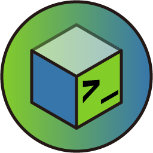
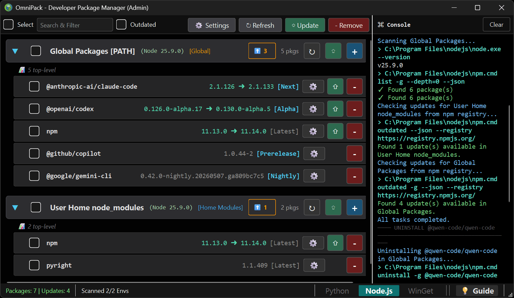
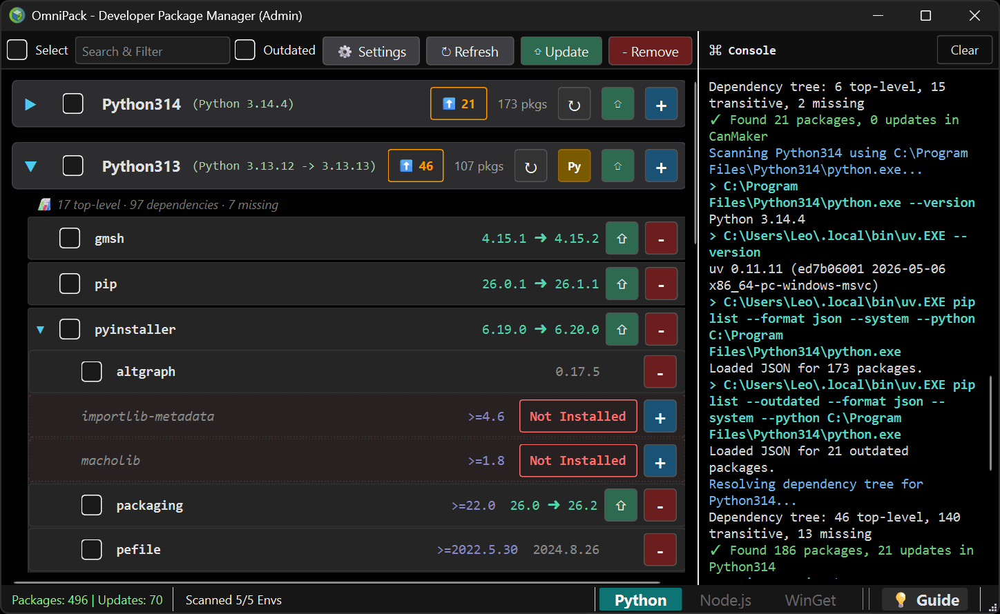

 

# OmniPack - Developer Package Manager

[English](./README.md) | [简体中文](./README.zh-CN.md)


[](https://github.com/astral-sh/uv)


[](https://deepwiki.com/LeoOfGit/OmniPack)

*The ultimate **sandbox environment & system package manager** for modern developers.*
> **OmniPack is a high-performance GUI wrapper for Python (uv/pip), Node.js (npm), and Windows Package Manager (WinGet).** It helps you manage scattered virtualenvs, explore deep dependency trees, handle local packages, and seamlessly control system-wide applications with unprecedented visual efficiency.

---


## 💡 Why OmniPack?

There are already excellent global app stores like UniGetUI and powerful native CLI tools like `pip`, `npm`, and `winget`. **What pain power does OmniPack solve?**

If you're a seasoned developer, your disk is likely scattered with **dozens** of legacy project folders containing `.venv` or `node_modules`.
- Every time you want to check or update dependencies for a project, you have to find the path -> open terminal -> `cd` -> `activate` -> type long commands... 
- When facing a hundred-line flat `pip list` error, you have no easy way to know which **top-level dependency** introduced that conflicting version.

OmniPack was born for this: **It's not a system app store; it's your environment isolation micro-manager in a sea of engineering code.**

---

## ✨ Core Features

### 🖥️ Built-in Interactive PTY Terminal
Say goodbye to the "blind" read-only simulated console! OmniPack features a full-fledged Pseudo-Terminal (PTY) engine integrated directly into the UI:
- **True PTY Integration**: Uses `pywinpty` on Windows and native `pty`/`os.fork()` on macOS/Linux to run real interactive shells with 0 MB size overhead.
- **Rich ANSI Capabilities**: Streamed output is parsed by the lightweight `pyte` library, supporting full ANSI color palette mapping and dynamic progress bars (e.g. `uv` / `pip` / `npm` downloads).
- **Silent Synchronization & Marker Interceptor**: Changing environments or working directories on the left instantly and silently switches directories (`cd`) or activates virtualenvs in the terminal. When performing package actions, OmniPack writes CLI commands to the terminal and monitors operation success via a unique UUID marker, triggering an incremental **Fast Refresh** on completion.
- **Highly Customizable**: Choose your preferred default shell (`cmd.exe`, `powershell.exe`, `pwsh.exe`, or custom shell binaries) and switch console modes instantly under the new Terminal settings tab.

### 🐧 Cross-Platform Runtime Installers & WinGet Setup
OmniPack handles runtime environment bootstrap across Windows, macOS, and Linux:
- **macOS & Linux Support**: Seamlessly download and bootstrap Python and Node.js runtimes. Linux supports automated installation via `uv` (for Python) or tarball decompression and automatic path symlinking (for Node.js). macOS supports downloading official `.pkg` packages and running GUI installers interactively.
- **System-Wide WinGet Setup (Windows)**: Automatically downloads and installs WinGet along with its required dependencies (VCLibs and UI.Xaml) on Windows using a background PowerShell worker, featuring full proxy support.
- **Resilient Network API**: Queries are protected with a 3-pass retry pipeline and connection sleep offsets, ensuring robustness during weak network conditions.

### ⛑️ Safe Update Intelligence: Constraint-Aware & Safe Intermediates
OmniPack knows which updates are **safe** and guides you through risk-free upgrades.
- **Safe Intermediate Recommendation**: When a package's latest version violates a version constraint, OmniPack automatically searches the version history to find the highest available version that *does* satisfy the constraint. Such packages are highlighted with a **blue** indicator and can be safely updated in one click.
- **Constraint-Aware Auto-Selection**: When "Outdated" is checked, packages that have *no* safe update path are **not auto-selected**. A visual `⚠` indicator explains why. Hovering over it details which upstream packages are imposing which specific version limits.
- **Real-time File System Sync**: Built-in directory watcher. Whether you run install commands in a system terminal or the embedded PTY, the UI auto-detects the changes and refreshes itself, keeping state perfectly in sync with the physical disk.
- **Build Variant Detection**: Automatically recognizes PEP 440 local version suffixes (`+cu132`, `+cpu`, `+rocm5.6`). If updating would switch your package between different hardware builds (CUDA → CPU), a `🔀` indicator warns you.

### 🌳 Crystal Clear: Hierarchical Dependency Tree
Break free from the command-line’s flat list black box.
- **Top-Level View**: Filters out noise and reveals the dependency tree you actually manually installed.
- **Infinite Hierarchy**: Who pulled in what? It’s clear at a glance.
- **Ghost Deps Capture**: Automatically identifies libraries called in your code but never officially declared.



### 🪟 Windows Native WinGet Deep Integration (Windows Only)
No need to launch a convoluted CLI or a cluttered third-party app store. OmniPack natively manages the built-in Windows Package Manager **WinGet**:
- **Unified App Management & Scope Tagging**: Merges separate Machine and User environment cards into a single "Applications" environment, dynamically auditing physical install paths to display `[sys]` (system) and `[user]` (user) badges directly on package cards (or both when co-existing).
- **Staged UWP/MSIX App Detection & Local Re-registration**: Offline scans the registry and `AppxManifest.xml` manifests to detect system-provisioned (Staged) but unregistered UWP applications, listing them as missing with a `[Staged]` tag and providing one-click background user-scope registration (`Add-AppxPackage`).
- **Non-Removable Safeguards & Win32 ARP Deduplication**: Automatically locks uninstall actions for critical protected system apps (like App Installer, Microsoft Store, and Edge) and uses GUID validations alongside name/version hashing to eliminate duplicate Win32 entries from overlapping registry paths.
- **Fixed-Width Column Slicing Console Parser**: Built with an East-Asian character-rendering width-padding calculation engine, making the table parser completely immune to column merging, empty values, or language-specific localized formatting.
- **Ignore Updates with Blocking Pin**: Integrated with the native `winget pin` command. Toggle Blocking Pins on specific apps via a ⚙ button, showing a `[Pinned]` badge, and automatically skipping updates in the global "Outdated" filter.
- **Intelligent Scope Fallback**: If an install or upgrade fails due to write permissions, locked folders, or path mismatch, OmniPack automatically attempts fallback installation with `--scope user` to ensure high success rates.

### 🔒 Virtual Environment File-Lock Guard
- **Silent File-Lock Diagnostics**: Detects if virtual environment upgrades (`python -m venv --upgrade`) fail due to locked executable files (`python.exe` occupied by IDEs, running scripts, or OmniPack itself). Intercepts console errors and warns the user with clear instructions, preventing environment corruption.

### 🎨 Runtime Setup Guide UI
- **Contextual Setup Prompts**: Displays a beautifully styled setup card (`RuntimeSetupWidget`) at the bottom of the scroll view when Pip, Npm, or WinGet panels have zero loaded environments, allowing users to trigger installation pipelines instantly.

### 🚀 High-Speed Engine: Native `uv` Power
It's not just fast; it’s fast even in a GUI! OmniPack natively integrates Astral sh's acclaimed `uv` engine. Enjoy order-of-magnitude faster downloads and resolution compared to traditional pip.

### 🛠️ Developer Experience & UI Polish (Secondary Features)
- **Environment Renaming & Settings Editing**: Right-click any Pip/Npm environment card header to rename aliases or edit settings, with automatic line highlighting.
- **Winget Package Manager Self-Upgrade**: Automatically displays the version of the `winget` binary and enables one-click upgrades via interactive PTY console.
- **Zero-Friction Batch Environment Import**: Copy directories from File Explorer or Everything and paste them directly to bulk-import virtual environments.
- **Copyable Dialog Labels & Package Details**: Injected a global event filter making QMessageBox and QDialog text copyable. Package configuration dialogs support one-click copy of name, ID, source, version, and location.
- **Node.js Dist-Tags Switcher**: Secondary switching between NPM dist-tags (latest, beta, rc, etc.).
- **Compiler-Grade Performance**: Supports compilation via Nuitka into a native single executable.

---

## 🚀 Quick Start

### Method 1: Download Portable Version (Recommended)
Go to the GitHub Releases area to get the latest pre-built single-file package (supports Windows/Linux/macOS). Double-click to run; all configuration and operation data will be recorded locally.

### Method 2: Run from Source
1. Ensure Python 3.10+ is installed.
2. Clone the repository and install dependencies:
   ```bash
   git clone https://github.com/LeoOfGit/OmniPack.git
   cd OmniPack
   pip install -r requirements.txt
   ```
3. Run:
   ```bash
   python OmniPack.py
   ```

---

## 📚 Detailed Documentation & Guides

- Questions? Shortcuts? Advanced features? 👉 [**《OmniPack User Guide》**](./docs/UserGuide.zh-CN.md)
- Low-level `QThread` synchronization and configuration details? 👉 [**《OmniPack Architecture Guide》**](./docs/Architecture.zh-CN.md)
- How to compile from source to a single-file executable? 👉 [**《OmniPack Compilation Guide》**](./docs/Compile.md)
- Interactive codebase visualization & documentation? 👉 [**《OmniPack DeepWiki》**](https://deepwiki.com/LeoOfGit/OmniPack)

---

## 🤝 Contributing

**OmniPack aims to be the most elegant cross-language developer package management center.**
Thanks to the highly decoupled `Panel <-> Manager` architecture, even with minimal UI experience, you can quickly write a Backend to integrate **Rust (Cargo), Go, Ruby (Gems)**, and more by reading the [Architecture Guide](./docs/Architecture.zh-CN.md)!

Pull Requests and Issues are more than welcome!

---

## 📄 License
This project is licensed under the [GPL v3.0 License](./LICENSE).
