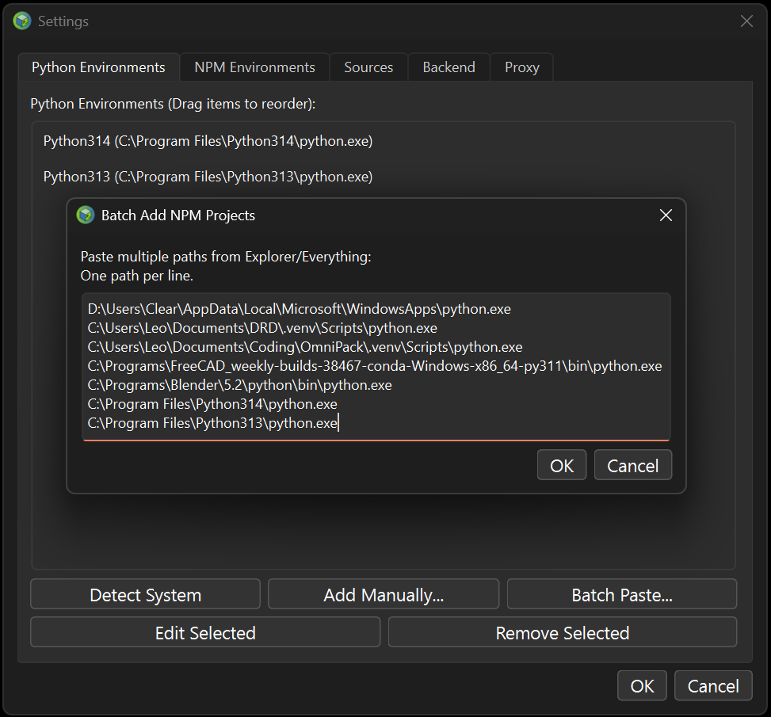
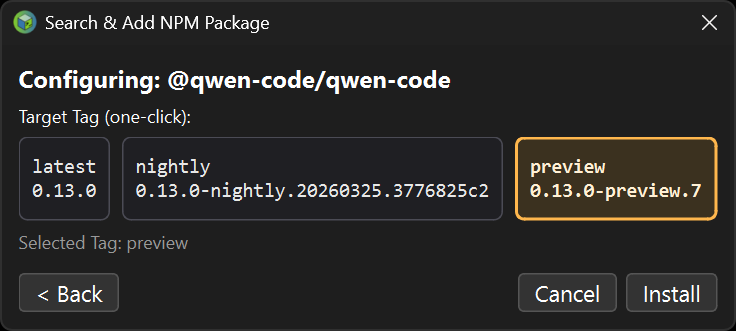
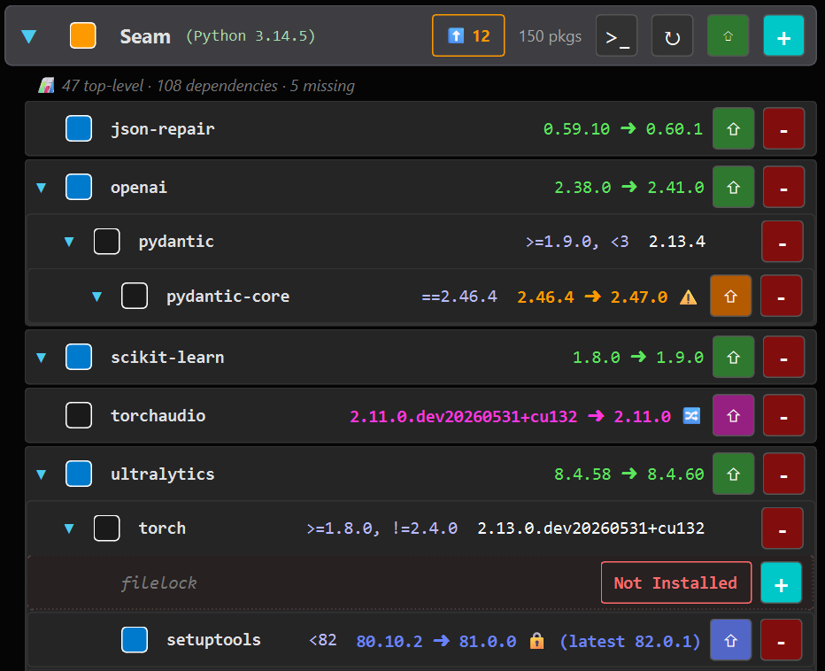
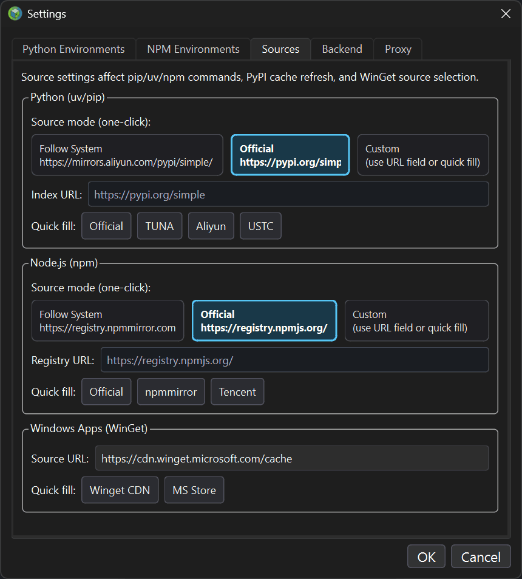

 

# OmniPack - 开发者包管理工具

[English](./README.md) | [简体中文](./README.zh-CN.md)


*专注于开发者所需的**隔离环境与系统包管理管家**。*
> **OmniPack 是一款专为 Python (uv/pip)、Node.js (npm) 以及 Windows 系统包管理器 (WinGet) 设计的高性能图形化管理工具。** 旨在帮助开发者更直观地管控本地散乱的虚拟环境、深度透视依赖树，并在 Windows 下统一纳管系统应用，显著提升包管理效率。
---


## 💡 为什么需要 OmniPack？

在市面上，我们已经有了像 UniGetUI 这样优秀的全局应用商店，也有了原生的强大命令行工具（如 `pip`、`npm`、`winget`）。**那么，OmniPack 解决的是什么痛点？**

如果你是一名资深开发者，你的磁盘上肯定散落着**数十个**包含 `.venv` 或 `node_modules` 的历史项目文件夹。
- 每次想要检查或更新某个项目的依赖，你都需要经历：找路径 -> 打开终端 -> `cd` -> `activate` -> 敲击冗长的命令... 
- 当你面对一份数百行的 `pip list` 扁平报错列表时，你根本不知道到底是**哪个顶层依赖**引入了这个该死的冲突版本。

OmniPack 就是为此而生：**它不是系统应用商店，它是你在工程代码海洋中的环境隔离微观管家。**

---

## ✨ 核心特性

### 🖥️ 内置交互式 PTY 终端 (v10 全新引入)
彻底告别只能看、不能动、甚至会因为交互性提问导致死锁的“模拟控制台”！OmniPack v10 将真正的伪终端 (PTY) 引擎直接整合到了 UI 界面中：
- **真正的 PTY 伪终端**：Windows 系统下通过 Nuitka 智能引入轻量级 `pywinpty`，编译体积增量极小；macOS / Linux 系统下直接调用 Python 原生标准库 `pty` 与 `os.fork()`，实现 **0 MB 额外体积开销** 的完美跨平台共享。
- **高色彩 ANSI 与动态进度条**：流式数据由轻量级色彩流解析库 `pyte` 强力驱动，完美支持终端 ANSI 转义字符序列的色彩染色（提供 VS Code 暗色调色盘），并且能完美流式呈现 `uv`、`pip`、`npm` 等包管理器的**动态字符进度条**。
- **静默环境同步与操作 Marker 拦截**：左侧环境卡片与工作目录变化时，主程序可无感地向 PTY 管道发送静默指令，在终端中实现自动 `cd` 切换目录和 `activate` 激活 venv。执行包安装、更新或卸载时，主程序将 CLI 语句写进终端执行，并通过唯一的 UUID 标记（Marker）进行结果过滤与成功捕获，结束后自动触发 UI 的**增量快速刷新 (Fast Refresh)**，响应极为迅速。
- **多壳程序支持与高度自定义**：可在设置页面中自主配置控制台默认的 Shell 解释器（内置 `cmd.exe`、`powershell.exe`、`pwsh.exe`，并支持指向任意自定义外部终端程序绝对路径），随时热切换只读模拟控制台（Simulated）与真实交互伪终端（Real Terminal）模式。

### 🚀 极速驱动层：原生的 `uv` 力量
不仅快，而且是在 GUI 下的快！OmniPack 底层深度整合了 [Astral sh](https://github.com/astral-sh/uv) 备受赞誉的 `uv` 引擎。享受比传统 pip 快一个量级的下载与解析速度。

### 🌳 洞若观火：层级依赖树透视
摆脱命令行的扁平列表黑盒。
- **Top-Level 视图**：过滤干扰，还原你真实手动安装的依赖树。
- **无限层级展开**：谁拉取了谁？一目了然。
- **幽灵依赖 (Ghost Deps) 捕获**：帮你智能抓取代码中调用了却没正式声明的“幽灵”库。


### 🗂️ 零摩擦纳管：一键批量导入项目环境
我们知道你有几十个项目。你只需要在 Everything 或文件管理器里全选这些文件夹，**Ctrl+C 复制路径**，然后到 OmniPack 中**一键大批量粘贴**（Batch Import）。它的内核探测器会自动替你扒开所有的 `.venv`，只提取出干净的项目代号。



### 🎯 极致的 Node.js 版本掌控
不止于 `npm install`。OmniPack 会动态拉取云端模块的 **Dist-Tags**，让你能在 `latest`, `beta`, `rc` 等分支通道间进行秒级下拉切换与预览。



### 🪟 Windows 内置 WinGet 深度集成 (Windows 特有)
无需打开复杂的命令行或第三方应用商店，OmniPack 原生纳管 Windows 内置包管理器 **WinGet**：
- **双 Scope 独立扫描**：智能区分系统全局安装 (Machine) 与当前用户专属安装 (User) 的桌面应用程序。
- **物理路径智能分配与去重**：自动读取 Windows 注册表并审计物理安装路径（如 `%USERPROFILE%`），将物理定位在用户目录下的软件智能重分配到 User 范围，消除重叠；若在双端同时存在，自动挂载 `[Also Installed In User/Machine]` 徽章避免重复。
- **命令行等宽解析**：针对 WinGet 繁琐的控制台本地化表格输出，自研基于东亚宽字符宽度 padding 的等宽解析引擎，彻底解决空值列与列错位漂移的问题。
- **锁定更新 (Blocking Pin)**：原生支持 `winget pin` 指令。可在 UI 中一键对特定应用开启 Blocking Pin，卡片展示 `[Pinned]` 徽章并在全局 "Outdated" 时阻止自动勾选，保护系统特定工具版本。
- **智能 Scope 自动回退 (Scope Fallback)**：在升级或安装因目录占用、特权写入受阻时，后台自动 fallback 回退执行 `--scope user` 权限进行补救重试，最大程度保障部署成功。

### 🧭 运行时补丁感知与更新
OmniPack 明确区分了**包更新**与**运行时更新**：
- **版本显示更准确**：环境卡片会显示 Python/Node 运行时版本；Python 虚拟环境优先读取 `pyvenv.cfg` 元数据，避免系统解释器补丁升级后“误跟随”。
- **同周期补丁检测**：针对 Python（如 `3.14.x`）和 Node（如 `25.x`）检测同一周期的最新补丁版本，并在卡片上直接显示 `当前 -> 最新`。
- **独立更新入口**：运行时更新使用单独按钮（`Py` / `Nd`），而 `⇧` 仍然只负责**包更新**。

### ⛑️ 安全更新智能：约束感知与安全中间版本推荐 (v12 增强)
OmniPack 能智能评估每个更新的安全性，并引导用户进行风险最小化的升级。
- **安全中间版本推荐 (Safe Update)**：当包的最新版本违反依赖约束时，OmniPack 会自动搜索版本历史，找到约束范围内的最高可用版本。受限但可安全升级的包将以**蓝色**高亮显示，并允许一键升级到该中间版本。
- **约束感知深度透视**：开启 "Outdated" 过滤时，若某个包完全没有可用的安全更新路径，该包将不会被自动选中，同时显示橙色 `⚠` 图标。悬停提示会详细列出哪些上游包施加了具体版本限制。
- **实时文件系统联动 (Real-time Sync)**：内置目录监听引擎。无论你是在系统终端还是内置 PTY 中手动运行安装命令，UI 都会在操作完成后自动感应并刷新，确保状态始终实时同步。
- **构建变体识别**：自动识别 PEP 440 本地版本后缀（`+cu132` 等）。若更新将改变硬件构建类型（如 CUDA 切到 CPU），会显示蓝色 `🔀` 图标提醒。



### ⚡ 编译级性能：跨平台原生丝滑体验
采用 PySide6 构建，并支持通过 [Nuitka](https://nuitka.net/) 编译为 C++ 级别的原生单一可执行文件（`.exe` / ELF binary）。它不仅具有极速响应，更能一键切换镜像源。



---

## 🚀 快速上手 (Quick Start)

### 方法 1：下载免安装便携版 (推荐)
前往 Github Releases 区域获取最新构建的单文件包（支持 Windows/Linux/macOS）。下载后双击即可运行，你的配置和操作数据均会自动记录，环境会随你而走。

### 方法 2：源码运行
1. 确保已安装 Python 3.10+
2. 克隆仓库并安装依赖：
   ```bash
   git clone https://github.com/LeoOfGit/OmniPack.git
   cd OmniPack
   pip install -r requirements.txt
   ```
3. 运行程序：
   ```bash
   python OmniPack.py
   ```

---

## 📚 详细文档与指南

- 使用中的疑问？快捷键？高级特性？ 👉 [**《OmniPack 用户指南 (UserGuide)》**](./docs/UserGuide.zh-CN.md)
- 关于底层 `QThread` 同步逻辑与配置落盘细节？ 👉 [**《OmniPack 架构说明 (Architecture)》**](./docs/Architecture.zh-CN.md)
- 如何从源码编译为单文件可执行程序？ 👉 [**《OmniPack 编译指南 (Compile)》**](./docs/Compile.zh-CN.md)

---

## 🤝 参与贡献

**OmniPack 旨在成为最优雅的跨语言开发者包管理中心。**
得益于高度解耦的 `Panel <-> Manager` 双层架构，即便您只有极少的 UI 经验，您也可以通过阅读 [Architecture.zh-CN.md](./docs/Architecture.zh-CN.md)，快速地编写一个 Backend，将 **Rust (Cargo)、Go、Ruby (Gems)** 等更多包管理器轻松接入！

欢迎提交 Issues 或者是 Pull Requests，让我们共同改进这款工具！

---

## 📄 许可证
本项目采用 [GPL v3.0 License](./LICENSE) 授权。
