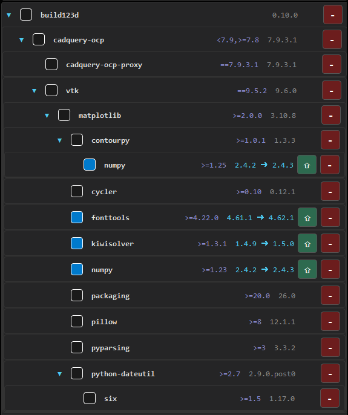
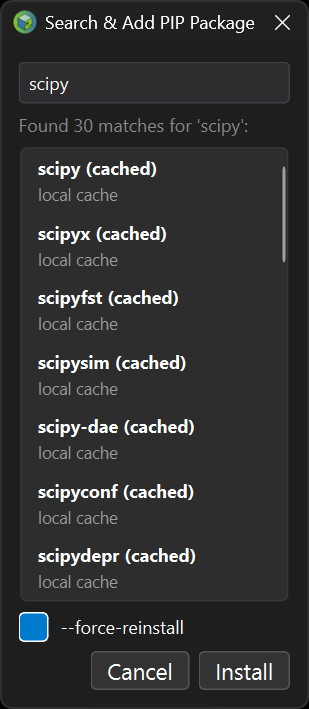
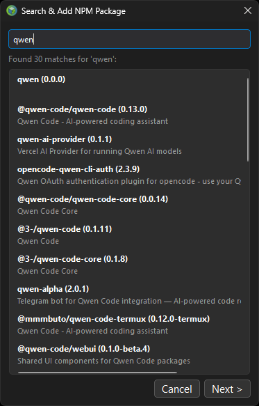
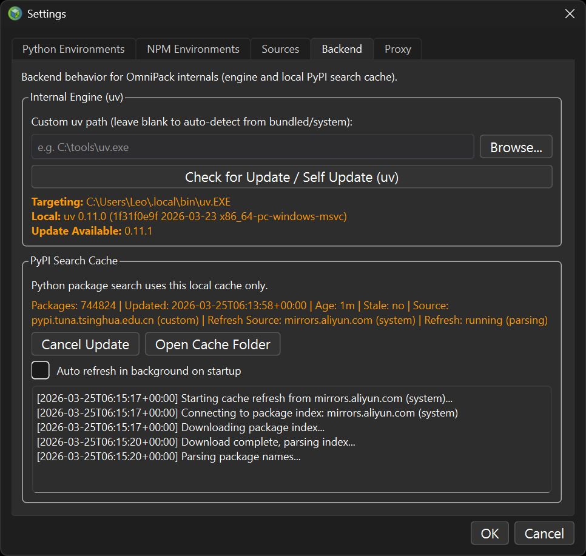
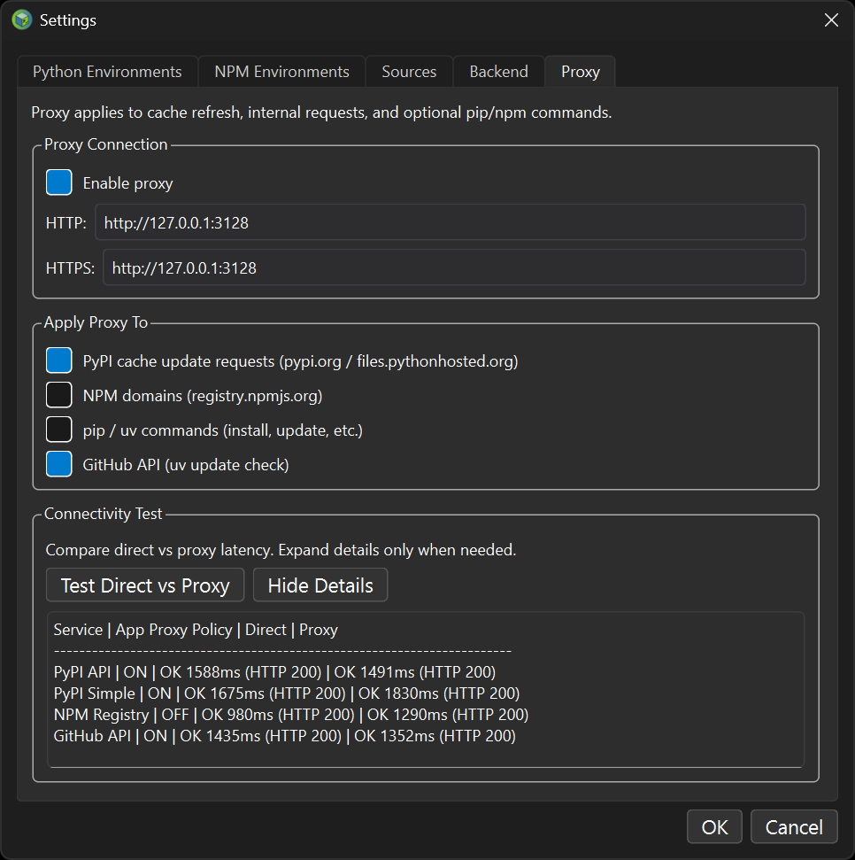

# OmniPack V4 用户指南 (User Guide)

欢迎使用 **OmniPack**！愿本程序成为您管理 Python 虚拟环境与 Node.js 项目依赖的得力工具。

---

## 目录
1. [界面布局全解析](#1-界面布局全解析)
2. [环境管理 (Environments)](#2-环境管理)
3. [Python (uv/pip) 深度管理](#3-python-uvpip-深度管理)
4. [Node.js (npm) 项目管理](#4-nodejs-npm-项目管理)
5. [设置中心 (Settings Center)](#5-设置中心)
6. [高级配置与环境变量参考](#6-高级配置与环境变量参考)
7. [常见问题解答 (FAQ)](#7-常见问题解答-faq)

---

## 1. 界面布局全解析

OmniPack 的主界面经过精心设计，分为四个核心交互区域。

### 1.1 顶层工具栏 (Global Toolbar)
这是执行全局搜索、过滤与批量指令的指挥中心。
- **选择控制 (All/None)**：快速全选或全取消当前主界面中所有可见的包。
- **搜索框 (Search)**：实时过滤各个环境卡片中显示的包名，支持模糊匹配。
- **待更新过滤 (Only Show Outdated)**：一键隐藏所有已是最新版本的包，让您可以集中处理需要升级的项目。
- **全局刷新 (Refresh All)**：重新扫描所有配置环境的本地包列表，并查询云端最新版本。
- **批量更新 (Batch Update)**：对当前所有【已勾选】且【云端有新版本】的包发起并行升级指令（仅作用于包，不更新解释器/Node 运行时）。
- **批量卸载 (Batch Remove)**：对所有当前勾选的包发起卸载指令（会有二次确认弹窗）。
- **设置 (Settings)**：直接跳转至环境配置与系统设置页面。

### 1.2 环境主体卡片 (Env Canvas)
左侧区域，以卡片形式展示每一个 Python 虚拟环境或 Node.js 项目。
- **环境信息**：每张卡片顶部显示环境别名、路径、运行时版本；当检测到同周期补丁更新时，会显示 `当前 -> 最新`。
- **操作按钮**：
    - `↻`：刷新当前环境
    - `⇧`：仅更新当前环境内所有可更新的包
    - `Py` / `Nd`：更新环境运行时本体（Python/Node）
    - `+`：添加包
- **包列表**：列出当前环境下安装的所有包及其版本。

### 1.3 实时控制台 (Live Console)
右侧区域，实时流式输出底层包管理器的执行详情。
- **分色输出**：系统消息（蓝色）、标准输出（白色）、标准错误（橙色）、失败报告（红色）。
- **右键功能**：支持“清空控制台”、“复制选区”以及“打开日志文件所在目录”。

### 1.4 状态栏反馈 (Status Bar)
位于窗口最底部，提供实时的统计与全局功能入口。
- **左侧统计区**：`Envs: {n} | Packages: {m} ( {u} Outdated )`。实时反映当前扫描出的环境总数、包总数及待更新统计。
- **中间状态区**：显示当前正在执行的操作（如 "Ready", "Scanning...", "Installing..."）。
- **右侧切换区**：
    - **Python / Node.js 按钮**：用于在两种包管理面板间快速切换。
    - **💡 Guide 按钮**：点击即可弹出本用户指南窗口。

> **注意**：若程序获得了管理员权限，**(Admin)** 标识会显示在窗口的**最上方标题栏**。

---

## 2. 环境管理

### 2.1 统一导入流程 (Unified Intake)
在 **Settings -> Python/NPM Environments** 中，您可以管理项目的生命周期。

- **Python 环境 (Pip/uv)**：
    - **Detect System**：扫描 PATH、注册表及桌面/用户目录下的 Python 解释器。
    - **Add Manually**：支持指向具体的 `python.exe` 解释器，或直接拖入包含 `.venv` 或 `venv` 的项目根目录。
- **Node.js 环境 (NPM)**：
    - **Add Manually**：支持指向 `package.json` 文件或其所在的任意父目录。OmniPack 会自动溯源至项目根节点并解析项目名。
- **Batch Paste (批量导入)**：您可以用Everything等搜索工具直接复制得到包含多个路径的多行文本，然后粘贴到输入框中，内置的 `env_detector` 引擎会自动执行去重、有效性验证和智能命名。。

### 2.2 环境操作说明
- **拖拽重排**：在列表项上长按图标即可上下拖动，调整环境在主界面的首选顺序。
- **编辑环境**：双击任意项可修改显示别名或修正因移动文件夹导致的路径变化。

---

## 3. Python (uv/pip) 深度管理

### 3.1 极速 uv 引擎
OmniPack 原生集成了一流的 [uv](https://github.com/astral-sh/uv) 引擎。
- **性能优势**：对于复杂的依赖解析和大规模包安装，由于 uv 采用 Rust 编写且具备高效缓存，其速度通常是 `pip` 的数十倍。
- **引擎更新**：在  `Settings` -> `Backend` 设置中，可以一键触发 `Check for Update` 异步检查并在线更新 `uv` 引擎，无需重装程序。

### 3.2 依赖查询与依赖树
- **层级展开**：点击包名前的箭头，可无限向下展示该包引入的子依赖（Dependency Tree）。
- **顶层视图**：默认仅显示您主动安装的包，隐藏由于级联关系引入的被动安装包，极大减少视觉噪音。

### 3.3 本地缓存驱动的包搜索
- **秒开响应**：OmniPack 内置了超过 50 万笔热门 PyPI 包的数据缓存。在主界面或“添加包”对话框搜索时，其响应速度堪比本地文件搜索。
- **搜索增强**：搜索时支持对结果按版本范围进行筛选。

### 3.4 Python 运行时补丁更新（解释器本体）
- **显示逻辑**：Python 虚拟环境卡片优先读取 `pyvenv.cfg` 的版本元数据，避免系统 Python 小版本升级后导致显示偏差。
- **更新检测**：按同一 `major.minor` 周期检测最新补丁（例如 `3.14.3 -> 3.14.4`）。
- **更新入口**：当检测到可更新时，卡片显示 `Py` 按钮。点击后执行的是解释器/venv 升级流程，而非 `pip` 包升级。
- **语义隔离**：`Py` 与 `⇧` 独立，前者更新运行时，后者更新包。

---

## 4. Node.js (npm) 项目管理

### 4.1 项目深度溯源
当您向 OmniPack 提供一个含有 Node.js 模块的任意深层文件夹时，它能自动确定真正的项目根目录，并精准展示出本地安装的模块版本。

### 4.2 在线搜索npm包
- **在线搜索**：从npm源搜索包，支持模糊匹配。

### 4.3 Dist-Tags 精准分发
OmniPack 将 NPM 的 `Dist-Tags` 机制进行了 GUI 封装。
- **标签切换**：在添加或更新包时，界面会整齐排列出所有远程 Release 通道（如 `latest`, `beta`, `next`, `lts`）。
- **一键更新**：点击对应标签卡片，系统会自动构造出如 `npm install lodash@beta` 这样的精准命令并执行。

### 4.4 Node.js 运行时补丁更新
- **版本展示**：Node 环境卡片会显示当前 Node 版本；若检测到同周期补丁更新，会展示 `当前 -> 最新`。
- **更新入口**：当可更新时显示 `Nd` 按钮，执行 Node 运行时升级。
- **注意区分**：`Nd` 更新 Node 运行时，`⇧` 更新 npm 包，二者互不替代。

---

## 5. 设置中心 (Settings Center)

设置对话框是 OmniPack 的后台核心，按功能划分为五个清晰的选项卡：

1.  **Python/NPM Environments**：环境列表维护区，支持增删改查及排序。
2.  **Sources (注册表/镜像源)**：
    *   **Follow System**：尊重系统原有的配置。
    *   **Official**：使用官方源。
    *   **Custom Preset**：内置清华、阿里、华为等顶级镜像，一键切换。
    *   **独立性**：此处的设置仅针对 OmniPack 调用的命令生效，不会修改您的系统全局配置。

3.  **Backend (核心引擎与缓存)**：
    *   **uv 路径管理**：手动指定或自动发现 `uv` 解释器。
    *   **PyPI Cache 同步**：提供可视化的同步日志流。支持在程序运行期间静默同步几千万条记录，并可以随时随时暂停或取消。

4.  **Proxy (代理配置)**：
    *   **协议分离**：支持独立的 HTTP 和 HTTPS 代理设置。后台命令多数情况会使用https，建议两个都填。
    *   **颗粒度控制**：可单独勾选哪些域名（PyPI / NPM / GitHub）需要通过代理服务器。
    *   **连通性测试**：一键执行 Direct vs Proxy 响应延迟对比。

---

## 6. 高级配置与环境变量参考

通过设置系统环境变量，您可以进一步解锁 OmniPack 的潜在功能：

| 变量名 | 描述 | 默认行为 | 备注 |
| :--- | :--- | :--- | :--- |
| `OMNIPACK_LIVE_RELOAD` | 启用样式的热重载 | 关 | 源码运行下修改 .qss 文件可即时生效 |
| `OMNIPACK_PORTABLE_CONFIG` | 强制使用便携模式 | 自动 | 优先级高于系统路径自动判定 |
| `OMNIPACK_TRACE_SELECTION` | 调试日志导出 | 关 | 将主界面所有的点击路径记录为 jsonl 文件 |
| `OMNIPACK_REQUIRE_ADMIN` | 提权申请策略 | 自动 | 设置为 0 可停止自动发起的 UAC 申请 |
| `OMNIPACK_SUPPRESS_QT_WARNINGS` | 屏蔽 Qt 重复警告 | 关 | 帮助保持终端/日志简洁 |

---

## 7. 常见问题解答 (FAQ)

**Q: 某些npm应用已经发布新版本，但程序未能检测到**
A: 很多npm的镜像源对nightly、preview等非正式版本的更新不及时，换用官方源即可。

**Q: 为什么“状态栏”中的统计数量和卡片中看到的不一致？**
A: 状态栏统计的是背景线程中所有已识别环境的总和，而卡片中显示的可能是经过“搜索框”过滤后的结果。

**Q: 如何让我的 Python 环境显示在 Settings 列表最前面？**
A: 在 Settings 对话框中，点击环境项左侧的拖拽手柄，将其移动到第一行并保存即可。

**Q: “控制台”显示更新失败，但包版本却变了？**
A: 这可能是由于底层工具（如 npm）在某些网络环境下报告了非零返回码。您可以点击对应卡片的“刷新”按钮查看环境的真实最新状态。

**Q: 为什么我看不到 `Py` / `Nd` 运行时更新按钮？**
A: 仅当检测到“同周期补丁可更新”时才显示该按钮。若当前已是最新补丁，或网络/源不可用导致暂时无法确认最新版本，按钮会隐藏。

**Q: `⇧` 和 `Py` / `Nd` 有什么区别？**
A: `⇧` 只更新环境内的包（pip/npm dependencies）；`Py` / `Nd` 更新的是解释器或 Node 运行时本体。

**Q: (Admin) 状态是什么触发的？**
A: 在 Windows 上以源码运行时，OmniPack 默认会自动请求管理员提权（可通过 `OMNIPACK_REQUIRE_ADMIN=0` 环境变量关闭）。提权成功后标题栏会显示 `(Admin)` 标记。打包发布版本则根据实际运行环境自动判断。

---

*OmniPack - 您手边最专业的全平台包管理专家。*
