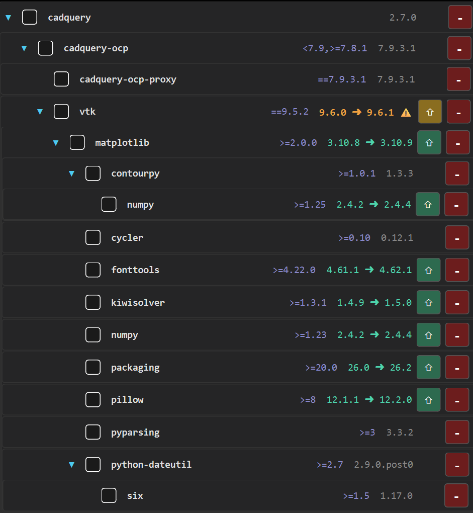
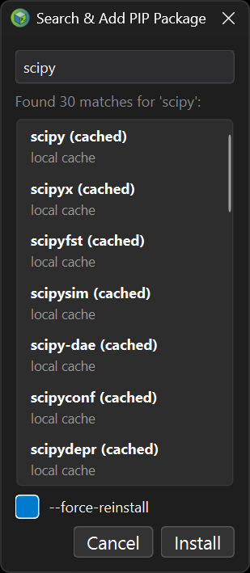
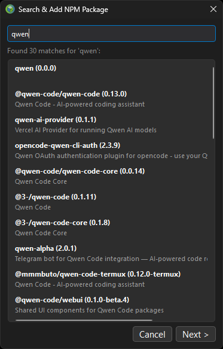
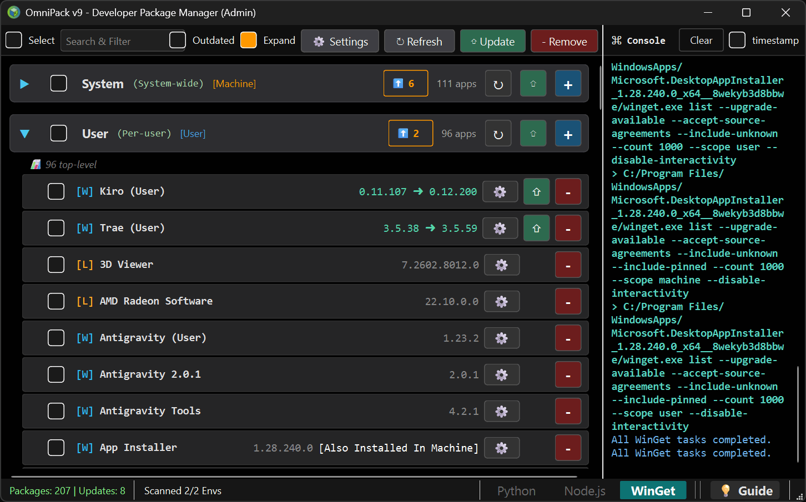
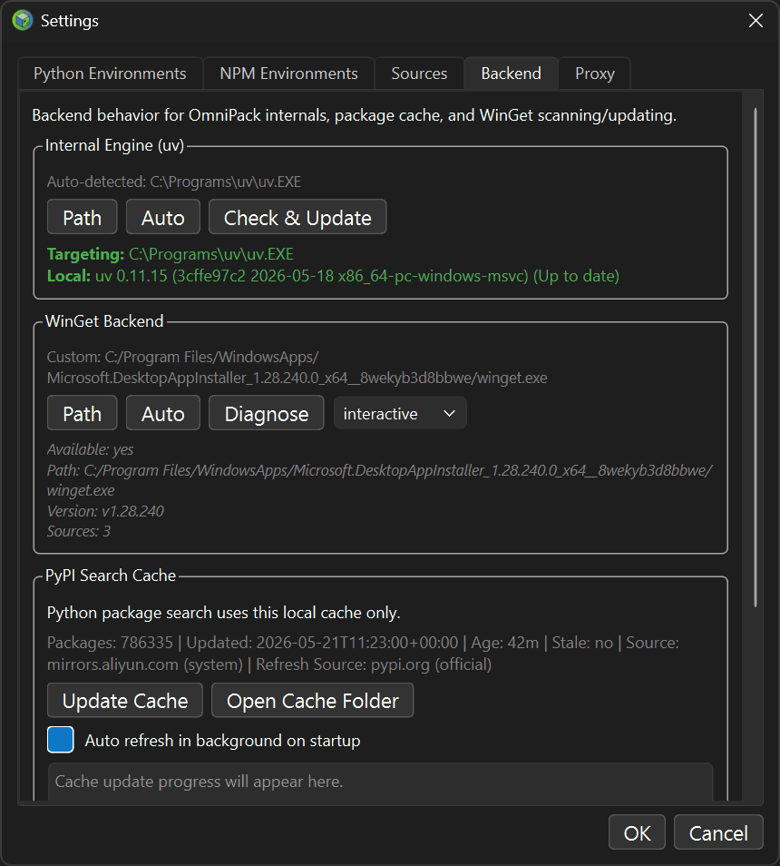
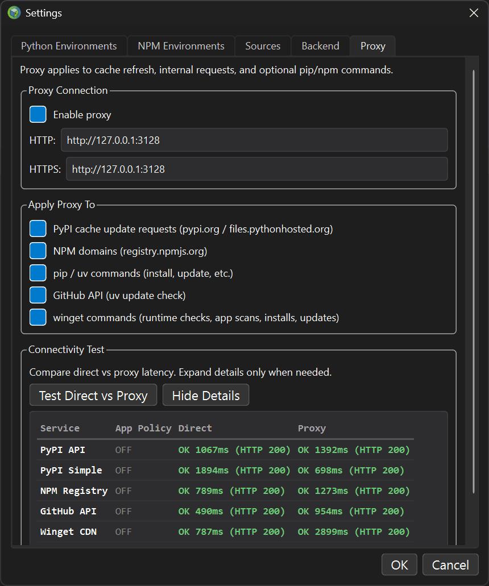

# OmniPack 用户指南 (User Guide)

欢迎使用 **OmniPack**！愿本程序成为您管理 Python 虚拟环境、Node.js 项目依赖以及 Windows 系统包管理器 WinGet 的得力工具。

---

## 目录
1. [界面布局全解析](#1-界面布局全解析)
2. [环境管理 (Environments)](#2-环境管理)
3. [Python (uv/pip) 深度管理](#3-python-uvpip-深度管理)
4. [Node.js (npm) 项目管理](#4-nodejs-npm-项目管理)
5. [WinGet 系统包管理 (Windows 特有)](#5-winget-系统包管理-windows-特有)
6. [设置中心 (Settings Center)](#6-设置中心)
7. [高级配置与环境变量参考](#7-高级配置与环境变量参考)
8. [常见问题解答 (FAQ)](#8-常见问题解答-faq)

---

## 1. 界面布局全解析

OmniPack 的主界面经过精心设计，分为四个核心交互区域。

### 1.1 顶层工具栏 (Global Toolbar)
这是执行全局搜索、过滤与批量指令的指挥中心。
- **选择控制 (All/None)**：快速全选或全取消当前主界面中所有可见的包。
- **搜索框 (Search)**：实时过滤各个环境卡片中显示的包名，支持模糊匹配。
- **待更新过滤 (Only Show Outdated)**：一键隐藏所有已是最新版本的包，让您可以集中处理需要升级的项目。系统会智能评估每个更新的安全性：约束冲突（橙色 `⚠`）和构建变体切换（蓝色 `🔀`）的包不会被自动选中，但若是存在安全中间版本（蓝色 `🔒`）则会被自动选中。
- **全局刷新 (Refresh All)**：重新扫描所有配置环境的本地包列表，并查询云端最新版本。
- **批量更新 (Batch Update)**：对当前所有【已勾选】且【云端有新版本】的包发起并行升级指令（仅作用于包，不更新解释器/Node 运行时）。
- **批量卸载 (Batch Remove)**：对所有当前勾选的包发起卸载指令（会有二次确认弹窗）。
- **设置 (Settings)**：直接跳转至环境配置与系统设置页面。

### 1.2 环境主体卡片 (Env Canvas)
左侧区域，以卡片形式展示每一个 Python 虚拟环境或 Node.js 项目。
- **环境信息**：每张卡片顶部显示环境别名、路径、运行时版本；当检测到同周期补丁更新时，会显示 `当前 -> 最新`。
- **操作按钮**：
    - `↻`：刷新当前环境
    - `⇧`：仅更新当前环境内所有可更新的包
    - `Py` / `Nd`：更新环境运行时本体（Python/Node）
    - `+`：添加包
- **包列表**：列出当前环境下安装的所有包及其版本。

### 1.3 集成伪终端与控制台 (Integrated PTY Terminal & Live Console)

右侧区域是 OmniPack 的核心执行显示中心，在 V10 中经过全新架构重构，支持两种互补的显示与交互模式（双控制台设计）：

- **交互式伪终端 (Real Terminal)**：
  - **实时深度交互**：这是一个真正的 PTY 终端 Shell（默认启用）。不仅可以实时流式呈现底层包管理命令的执行日志，还能接受您的全盘键盘输入。这意味着在遇到 `git clone` 账户密码输入、或安装中途需要输入 `y/n` 进行确认等高交互场景时，您可以直接在终端中打字并回车，彻底打破了以往“模拟控制台”容易产生进程死锁的硬伤。
  - **ANSI 丰富染色**：底层搭载了 `pyte` 色彩染色引擎，完美解析 ANSI 转义序列。这意味着 `uv`、`pip`、`npm` 在终端里绘制的**动态高色彩字符进度条**、或者带颜色的错误堆栈，均能在控制台内平滑流畅地流动展示，还原了极其丝滑的原生终端视觉体验。
  - **环境与目录静默同步 (Active Sync)**：终端与左侧的环境状态实现了深度联动。每当您切换或激活左侧的环境卡片时，主程序会静默且无感地发送 `cd` 改变目录或调用激活 `venv` 的指令，实现“界面点到哪，终端跟到哪”的顺畅同步。
  - **操作容器化与 UI 快刷**：在 PTY 终端模式下，面板按钮触发的“更新”、“安装”或“卸载”均会直接转化为 CLI 命令写进终端窗口中运行。命令末尾自动追加一个唯一的 UUID Marker（标记）。主程序后台捕捉该 Marker 以判定命令执行完毕，并立刻对环境进行**增量快速刷新 (Fast Refresh)**，大大减少了界面的重绘卡顿。
  - **键盘高级组合**：完美拦截 Tab 键命令补全、上下方向键回溯历史、`Ctrl+C` 强行中断子任务，以及 `Ctrl+V` 系统剪贴板文字粘贴。
- **只读模拟控制台 (Simulated Console)**：
  - 如果您在设置中将模式切换为只读模拟控制台，它将作为安全保底存在，被动地以富文本日志形式展示命令的 `stdout` 与 `stderr`，且提供基于正则表达式的 ANSI 字符剔除过滤。
  - 右键支持“清空控制台”、“复制选区”以及“打开日志文件所在目录”等通用功能。

### 1.4 状态栏反馈 (Status Bar)
位于窗口最底部，提供实时的统计与全局功能入口。
- **左侧统计区**：`Envs: {n} | Packages: {m} ( {u} Outdated )`。实时反映当前扫描出的环境总数、包总数及待更新统计。
- **中间状态区**：显示当前正在执行的操作（如 "Ready", "Scanning...", "Installing..."）。
- **右侧切换区**：
    - **Python / Node.js / WinGet 按钮**：用于在不同的包管理面板之间快速切换（WinGet 面板仅在 Windows 系统下可见）。
    - **💡 Guide 按钮**：点击即可弹出本用户指南窗口。

> **注意**：若程序获得了管理员权限，**(Admin)** 标识会显示在窗口的**最上方标题栏**。

---

## 2. 环境管理

### 2.1 统一导入流程 (Unified Intake)
在 **Settings -> Python/NPM Environments** 中，您可以管理项目的生命周期。

- **Python 环境 (Pip/uv)**：
    - **Detect System**：扫描 PATH、注册表及桌面/用户目录下的 Python 解释器。
    - **Add Manually**：支持指向具体的 `python.exe` 解释器，或直接拖入包含 `.venv` 或 `venv` 的项目根目录。
- **Node.js 环境 (NPM)**：
    - **Add Manually**：支持指向 `package.json` 文件或其所在的任意父目录。OmniPack 会自动溯源至项目根节点并解析项目名。
- **Batch Paste (批量导入)**：您可以用Everything等搜索工具直接复制得到包含多个路径的多行文本，然后粘贴到输入框中，内置的 `env_detector` 引擎会自动执行去重、有效性验证和智能命名。。

### 2.2 环境操作说明
- **拖拽重排**：在列表项上长按图标即可上下拖动，调整环境在主界面的首选顺序。
- **编辑环境**：双击任意项可修改显示别名或修正因移动文件夹导致的路径变化。

---

## 3. Python (uv/pip) 深度管理

### 3.1 极速 uv 引擎
OmniPack 原生集成了一流的 [uv](https://github.com/astral-sh/uv) 引擎。
- **性能优势**：对于复杂的依赖解析和大规模包安装，由于 uv 采用 Rust 编写且具备高效缓存，其速度通常是 `pip` 的数十倍。
- **引擎更新**：在  `Settings` -> `Backend` 设置中，可以一键触发 `Check for Update` 异步检查并在线更新 `uv` 引擎，无需重装程序。

### 3.6 实时文件系统联动 (Real-time Sync) (v12 新增)
OmniPack 内置了**目录监听引擎 (File System Watcher)**，无需任何配置即可生效。
- **脱机操作同步**：如果您在系统外部终端（如 `cmd.exe`）或 OmniPack 的内置 PTY 终端中直接运行了 `pip install xxx` 或 `uv pip install xxx`（NPM 面板则监听 `node_modules`），当命令结束后（无论成功或失败），OmniPack 会在静默 2 秒后**自动**抓取 `site-packages` / `node_modules` 目录的物理变化，并触发对应环境卡片的自动刷新。
- **多端协作无缝衔接**：该机制省去了频繁点击 `↻` 刷新按钮的繁琐步骤，实现了 UI 状态与硬盘物理状态的绝对实时一致。

### 3.2 依赖查询与依赖树
- **层级展开**：点击包名前的箭头，可无限向下展示该包引入的子依赖（Dependency Tree）。
- **顶层视图**：默认仅显示您主动安装的包，隐藏由于级联关系引入的被动安装包，极大减少视觉噪音。

### 3.3 本地缓存驱动的包搜索
- **秒开响应**：OmniPack 内置了超过 50 万笔热门 PyPI 包的数据缓存。在主界面或“添加包”对话框搜索时，其响应速度堪比本地文件搜索。
- **搜索增强**：搜索时支持对结果按版本范围进行筛选。

### 3.4 Python 运行时补丁更新（解释器本体）
- **显示逻辑**：Python 虚拟环境卡片优先读取 `pyvenv.cfg` 的版本元数据，避免系统 Python 小版本升级后导致显示偏差。
- **更新检测**：按同一 `major.minor` 周期检测最新补丁（例如 `3.14.3 -> 3.14.4`）。
- **更新入口**：当检测到可更新时，卡片显示 `Py` 按钮。点击后执行的是解释器/venv 升级流程，而非 `pip` 包升级。
- **语义隔离**：`Py` 与 `⇧` 独立，前者更新运行时，后者更新包。

### 3.5 风险感知更新 (Risk-Aware Updates)

当您开启工具栏的 **"Outdated"** 过滤时，并非所有可更新的包都会被自动选中。系统会对以下两类高风险更新进行**智能拦截**：

#### 约束冲突（橙色 ⚠ 标识）
如果一个包的依赖者对其设定了版本上限（如 `sympy` 依赖 `mpmath<1.4`），而最新版超过了该上限，那么该包：
- 不会被 `Outdated` 自动勾选
- 版本文本显示为橙黄色：`1.3.0 ➜ 1.4.1 ⚠`
- 鼠标悬停时提示："Latest version may break version constraints from: sympy"
- 点击 `⇧` 按钮时弹出确认对话框，告知具体的约束来源

#### v12 智能安全升级（蓝色 🔒 标识） (Safe Intermediate Update)
v12 引入了更优雅的版本选择机制。若最新版被约束阻断，系统会自动扫描历史版本，**寻找约束范围内允许的最高可用版本**：
- 版本文本显示为亮蓝色：`1.3.0 ➜ 1.3.5 🔒 (最新 1.4.1)`
- 鼠标悬停时不仅显示冲突约束，还会特别提示 "可安全更新到 1.3.5"
- 升级按钮变为蓝色且**不需要二次确认**，点击即可丝滑更新到 1.3.5
- 此类型的受限包会被 `Outdated` **自动勾选**，便于您批量升级

#### 构建变体切换（蓝色 🔀 标识）
对于带有本地版本标识的包（如 `torchaudio 2.11.0.dev20260506+cu132`），当最新版不带该标识或标识不同时：
- 不会被 `Outdated` 自动勾选
- 版本文本显示为亮蓝色：`2.11.0.dev+cu132 ➜ 2.11.0 🔀`
- 鼠标悬停时提示："Build variant may change: +cu132 → (none)"
- 点击 `⇧` 按钮时弹出确认对话框，告知构建类型可能改变

> **手动操作不受限**：以上拦截仅针对 `Outdated` 过滤的自动选中行为。您仍可手动勾选这些包，或直接点击其 `⇧` 按钮并确认风险后进行更新。

---

## 4. Node.js (npm) 项目管理

### 4.1 项目深度溯源
当您向 OmniPack 提供一个含有 Node.js 模块的任意深层文件夹时，它能自动确定真正的项目根目录，并精准展示出本地安装的模块版本。

### 4.2 在线搜索npm包
- **在线搜索**：从npm源搜索包，支持模糊匹配。

### 4.3 Dist-Tags 精准分发
OmniPack 将 NPM 的 `Dist-Tags` 机制进行了 GUI 封装。
- **标签切换**：在添加或更新包时，界面会整齐排列出所有远程 Release 通道（如 `latest`, `beta`, `next`, `lts`）。
- **一键更新**：点击对应标签卡片，系统会自动构造出如 `npm install lodash@beta` 这样的精准命令并执行。

### 4.4 Node.js 运行时补丁更新
- **版本展示**：Node 环境卡片会显示当前 Node 版本；若检测到同周期补丁更新，会展示 `当前 -> 最新`。
- **更新入口**：当可更新时显示 `Nd` 按钮，执行 Node 运行时升级。
- **注意区分**：`Nd` 更新 Node 运行时，`⇧` 更新 npm 包，二者互不替代。

---

## 5. WinGet 系统包管理 (Windows 特有)

在 Windows 10/11 操作系统下，OmniPack 会自动在状态栏右侧注册 **WinGet** 包管理面板。它能对您系统上通过 Microsoft Store、WinGet 源或本地安装的桌面应用程序进行统一纳管。

### 5.1 双 Scope 环境自动探测 (Dual Scope Environment)
在主界面左侧会展示两个虚拟的系统环境：
- **System (Machine)**：显示系统全局安装的软件（对应 `winget://machine`），通常位于 `Program Files` 目录下，更新时需要管理员权限。
- **User**：显示当前用户专属安装的软件（对应 `winget://user`），通常位于用户个人目录下（如 `%USERPROFILE%\AppData`）。
- **去重与范围智能判定 (Package Redistribution)**：
  - OmniPack 内置了注册表物理路径审计机制。在扫描软件时，它会读取卸载路径，如果发现某个全局上报的软件其实物理安装在用户目录中，会自动将其归类到 **User** 虚拟环境中，保证信息的绝对精准。
  - 若同一个软件在系统和用户下都被安装了，卡片上会自动挂载 `[Also Installed In User/Machine]` 彩色徽章。

### 5.2 精准管理与锁定更新 (Full Actions & Pinning)
- **获取更新 (Upgrades)**：如果有可用更新，应用卡片上会显示 `⇧` 按钮。
- **配置与锁定 (Blocking Pin)**：
  - 点击应用卡片上的 **⚙ 配置按钮**，会弹出专属配置框。
  - 支持设置 **锁定更新 (winget blocking pin)**。勾选“忽略此应用的更新（winget 锁定 Pin）”后，该应用在卡片上会挂载 `[Pinned]` 徽章，同时不会被工具栏 "Outdated" 选项自动勾选，避免大面积静默升级破坏特定软件版本。
  - 在配置框中，您还可以直接查看该软件的**物理安装路径 (Uninstall Location)** 并进行一键鼠标选定与复制，极其方便定位软件根目录。
- **版本异常警告 (⚠ Newer Badge)**：
  - 如果您从官网安装了比 WinGet 云端注册表更新的版本，系统会挂载 `[⚠ Newer]` 徽章警告，并阻止 `Outdated` 自动勾选它，防止误退级。
- **安装新包 (Install)**：
  - 点击卡片标题栏的 `+` 按钮，可以输入任意 WinGet 软件 ID（如 `Google.Chrome`）直接进行下载并静默或交互安装。
- **智能范围回退机制 (Scope Fallback)**：
  - 在 Machine 范围升级或安装大型软件如果遇到文件占用或写入权限问题而报错，OmniPack 会自动执行 Fallback，改为以 `--scope user` 尝试向用户范围下载安装，极大地提高了对软件版本自动更新的宽容度。

---

## 6. 设置中心 (Settings Center)

设置对话框是 OmniPack 的后台核心，按功能划分为六个清晰的选项卡（在 Windows 下）：

1.  **Python/NPM Environments**：环境列表维护区，支持增删改查及排序。
2.  **Sources (注册表/镜像源)**：
    *   **Follow System**：尊重系统原有的配置。
    *   **Official**：使用官方源。
    *   **Custom Preset**：内置清华、阿里、华为等顶级镜像，一键切换。
    *   **独立性**：此处的设置仅针对 OmniPack 调用的命令生效，不会修改您的系统全局配置。

3.  **Backend (核心引擎与缓存)**：
    *   **uv 路径管理**：手动指定或自动发现 `uv` 解释器。
    *   **PyPI Cache 同步**：提供可视化的同步日志流。支持在程序运行期间静默同步几千万条记录，并可以随时随时暂停或取消。

4.  **Proxy (代理配置)**：
    *   **协议分离**：支持独立的 HTTP 和 HTTPS 代理设置。后台命令多数情况会使用https，建议两个都填。
    *   **颗粒度控制**：可单独勾选哪些域名（PyPI / NPM / GitHub）需要通过代理服务器。
    *   **连通性测试**：一键执行 Direct vs Proxy 响应延迟对比。

5.  **WinGet (Windows 专属设置)**：
    *   **安装模式选择**：支持配置 winget 安装和升级的全局行为模式：静默模式 (`silent`)、交互模式 (`interactive`)、默认模式 (`default`)。
    *   ** winget.exe 路径**：支持自动探测系统 PATH 上的 winget 进程，也支持手动浏览定位自定义的 winget 绝对路径。
    *   **实时诊断状态**：在设置页面内建 Diagnostics 控制台，可实时探知 winget 引擎是否可用、系统物理绝对路径、运行版本以及已启用的注册表源数量与可能上报的源配置错误。
6.  **Terminal (终端与控制台配置)**：
    *   **控制台模式 (Console Mode)**：支持用户在线自由切换控制台模式。可选 `Simulated Console`（经典的只读日志流模式，安全保底）与 `Real Terminal`（PTY 交互终端模式，默认启用）。
    *   **默认 Shell 选择**：支持配置内置伪终端默认调起的 Shell 程序（内置 `cmd.exe`、`powershell.exe`、`pwsh.exe`，并支持自定义特定外部 Shell 绝对路径）。

---

## 7. 高级配置与环境变量参考

通过设置系统环境变量，您可以进一步解锁 OmniPack 的潜在功能：

| 变量名 | 描述 | 默认行为 | 备注 |
| :--- | :--- | :--- | :--- |
| `OMNIPACK_LIVE_RELOAD` | 启用样式的热重载 | 关 | 源码运行下修改 .qss 文件可即时生效 |
| `OMNIPACK_PORTABLE_CONFIG` | 强制使用便携模式 | 自动 | 优先级高于系统路径自动判定 |
| `OMNIPACK_TRACE_SELECTION` | 调试日志导出 | 关 | 将主界面所有的点击路径记录为 jsonl 文件 |
| `OMNIPACK_REQUIRE_ADMIN` | 提权申请策略 | 自动 | 设置为 0 可停止自动发起的 UAC 申请 |
| `OMNIPACK_SUPPRESS_QT_WARNINGS` | 屏蔽 Qt 重复警告 | 关 | 帮助保持终端/日志简洁 |

---

## 8. 常见问题解答 (FAQ)

**Q: 某些npm应用已经发布新版本，但程序未能检测到**
A: 很多npm的镜像源对nightly、preview等非正式版本的更新不及时，换用官方源即可。

**Q: 为什么“状态栏”中的统计数量和卡片中看到的不一致？**
A: 状态栏统计的是背景线程中所有已识别环境的总和，而卡片中显示的可能是经过“搜索框”过滤后的结果。

**Q: 如何让我的 Python 环境显示在 Settings 列表最前面？**
A: 在 Settings 对话框中，点击环境项左侧的拖拽手柄，将其移动到第一行并保存即可。

**Q: “控制台”显示更新失败，但包版本却变了？**
A: 这可能是由于底层工具（如 npm）在某些网络环境下报告了非零返回码。您可以点击对应卡片的“刷新”按钮查看环境的真实最新状态。

**Q: 为什么我看不到 `Py` / `Nd` 运行时更新按钮？**
A: 仅当检测到“同周期补丁可更新”时才显示该按钮。若当前已是最新补丁，或网络/源不可用导致暂时无法确认最新版本，按钮会隐藏。

**Q: `⇧` 和 `Py` / `Nd` 有什么区别？**
A: `⇧` 只更新环境内的包（pip/npm dependencies）；`Py` / `Nd` 更新的是解释器或 Node 运行时本体。

**Q: (Admin) 状态是什么触发的？**
A: 在 Windows 上以源码运行时，OmniPack 默认会自动请求管理员提权（可通过 `OMNIPACK_REQUIRE_ADMIN=0` 环境变量关闭）。提权成功后标题栏会显示 `(Admin)` 标记。打包发布版本则根据实际运行环境自动判断。

**Q: 为什么在 macOS 或 Linux 上我看不到 WinGet 选项卡或面板？**
A: WinGet 是 Windows 系统的内置包管理器，因此 OmniPack 仅在 Windows 操作系统下动态注册并显示 WinGet 面板和设置选项。

**Q: WinGet 更新时提示需要管理员权限怎么办？**
A: 升级系统全局应用（Machine 范围）通常需要写入 `C:\Program Files` 等系统敏感路径，这需要管理员特权。建议右键以管理员身份运行 OmniPack，或在系统提示时接受 UAC 提权请求。如果更新失败，OmniPack 会自动执行 Fallback，尝试以 `--scope user` 权限进行安装，最大程度保障部署成功。

**Q: 为什么集成终端里常常输出一些带有 `__OMNIPACK_OP_DONE_<uuid>__` 的字符串？**
A: 这是 OmniPack 早期版本（v10/v11）为了实现“界面操作与真实终端完美联动”而设计的高性能标记（Marker）系统。在最新的 v12 版本中，底层已经升级为更稳健的**临时文件标记机制**（在系统临时目录生成 `.done` 文件以捕获退出码），从而彻底避免了正则拦截输出在某些复杂终端环境下的偶发抖动。如果您在终端中看到残留的 UUID 字符串，通常是早前复制粘贴的旧命令尚未清理，属正常现象，您可以安全地忽略或 `cls` / `clear` 清理。

**Q: 在集成终端中，除了执行包管理器的命令，我还可以执行其他普通命令吗？**
A: 完全可以！因为它是一个完整、真实的系统 Shell 伪终端（PTY）。您可以把它当成普通的 Terminal 使用，比如键入 `git status`、`ls`、`dir` 或者是运行您的 Python 脚本，它都完美支持，并且同样具有高色彩 ANSI 渲染和 Tab 自动补全功能。

**Q: 我在设置中修改了终端默认 Shell，为什么没有立即变化？**
A: 终端的 Shell 调起以及模式的切换（模拟/真实终端）由于涉及到底层 PTY 进程与线程的销毁与重新实例化，因此需要您**重新启动 OmniPack** 才会正式生效。

---

*OmniPack - 您手边最专业的全平台包管理专家。*
